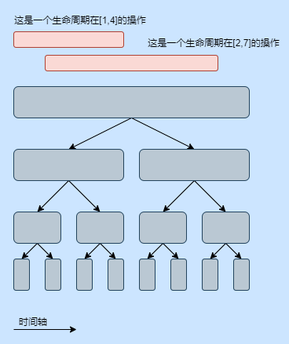
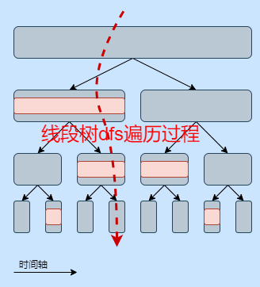

# 线段树分治

线段树分治用于在某些数据结构只能添加不能删除的前提下，要求支持添加和删除操作。例如并查集只能合并，合并后不支持再拆分，在这种场景下，线段树分治使用回溯的方法代替删除操作。

 ## 该算法的使用条件

1、题目可以使用离线算法
2、该数据结构不能存在均摊复杂度（可持久化的前提条件）

## 算法讲解

线段树分治算法的核心思想为将某一个操作拆解为至多logN个操作标记下放，在线段树遍历时处理该操作标记，在回溯时退掉标记消除影响。

例如，现在需要维护某种数据结构，要求该数据结构的修改在[l,r]内有效，称该修改的生命周期为[l,r]。



如图所示，假设有两个操作，分别需要在第1个时刻修改，在第5个时刻删除该修改。在第2个时刻发生修改，在第8个时刻删除该修改。

如果按照传统做法，以时间维度为扫描线扫过去。则像并查集这样的到了删除时就无法操作。

所以换一个思路，先建一颗尺寸为时间轴总长度的线段树，将操作下放到线段树的节点中。



如图所示，例如此时我们想知道第4个时刻的影响，就通过线段树dfs遍历的方式走到第4个叶子结点，在过程中暴力处理操作标记。（由于每个标记至多被拆分成2log个，所以这里可以暴力处理，无需合并标记）。

此时回溯就不需要删除操作了，而是类似可持久化的思路，实现回退功能即可。

## 模板参数说明

`T`：操作标记的类型

`N`:线段树分治的时间轴长度，为了某些题目方便，本模板建树时统一从0建到N。即有效下标为[0,N]多一个下标。

## 接口说明

### 外部接口

`doOperator(const T &oper)`：外部接口：如何处理一个操作标记？（算法模板传入oper表示addOperator添加的操作标记）

`saveState()`：外部接口：当处理完成线段树某节点上的所有标记时，如何储存当前状态？

`loadState()`：外部接口：当线段树递归完成左子树操作时，如何回溯？

`solveNotify(int pos)`：外部接口：当求解完成时（递归到叶子结点），需要做何种操作？算法模板传入pos表示当前叶子结点下标）

### 调用接口

`addOperator(int l, int r, const T &oper)`：调用接口：添加一个操作，该操作的生命周期为[l,r]。


`slove()`执行线段树分治算法求解，在求解完成时，通过solveNotify 外部接口通知外部调用者求解完成。

## 快速上手

算法模板实例化方式
```c++
chino::segmentTreeDivide<T> segtd(N);
segtd.doOperator=doOperator(const T &oper);
segtd.saveState=saveState();
segtd.loadState=loadState();
segtd.solveNotify=solveNotify(int pos);
```

算法模板源码见：[线段树分治算法模板文件](../../template/dataStructure/segmentTreeDivide.h) 

 以`luogu-P5787`为例，该题目中需要一个数据结构支持加边、删边。使用回退代替删边，只需要处理加边。

 ### 自定义T类型的操作标记

 需要设计一个T类型来储存加边操作所需的数据，这里只需要保存一条边的两个端点即可。
 
 ```c++
struct node
{
    int u, v; //一条边的左右端点。
};
 ```

 ### 实现doOperator接口

 二分图判定，经典trick。使用扩展域并查集维护二分图状态（如果合并后发现扩展域和本体在同一个集合中就不是二分图）。

 ```c++
 vector<pair<int, unsigned int>> stk{{1, 0}}; //是否为二分图 - 可回退并查集当前的时间戳
chino::rollbackDisjointSetUnion dsu(2 * MAXN);
auto doOperator = [&](const node &op)
{
    if (stk[stk.size() - 1].first == 0)
    {
        return;
    }

    dsu.join(op.u, op.v + n);
    dsu.join(op.v, op.u + n);
    if (dsu.find(op.u) == dsu.find(op.u + n) ||
        dsu.find(op.v) == dsu.find(op.v + n))
    {
        stk[stk.size() - 1].first = 0;
    }
};
```

### 实现saveState接口

这里使用已经封装好的可退数据结构，在saveState接口中保存一下时间戳即可。

```c++
auto saveState = [&]()
{
    auto now = stk[stk.size() - 1];
    stk.push_back({now.first, dsu.getStamp()});
};
```
### 实现loadState接口

这里使用已经封装好的可退数据结构，在loadState接口中使用刚刚保存的时间戳回滚到saveState的版本。

```c++
auto loadState = [&]()
{
    dsu.rollback(stk[stk.size() - 1].second);
    stk.pop_back();
};
```
### 实现solveNotify接口

求解完成，转存到ans数组中输出。

```c++
auto solveNotify = [&](int pos)
{
    ans[pos] = stk[stk.size() - 1].first;
};
```

完整代码见：[luogu-P5787](../../example/segmentTreeDivide/luogu-P5787/main.cpp) 

